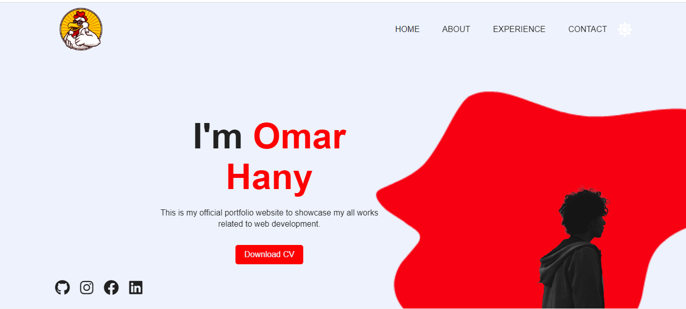
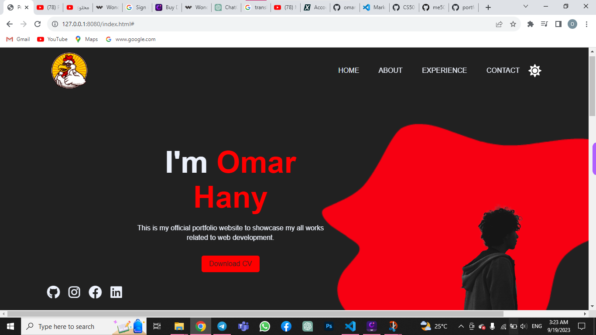
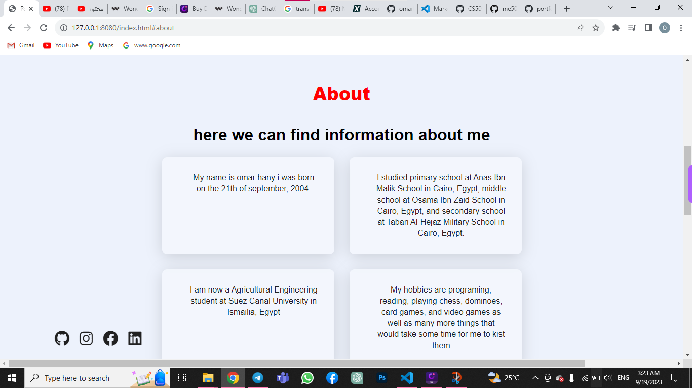
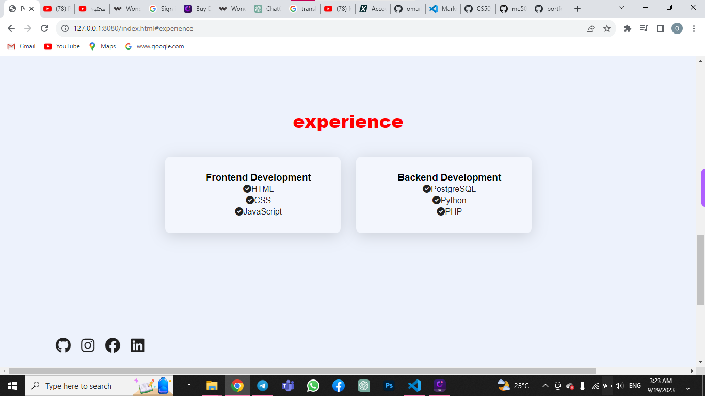
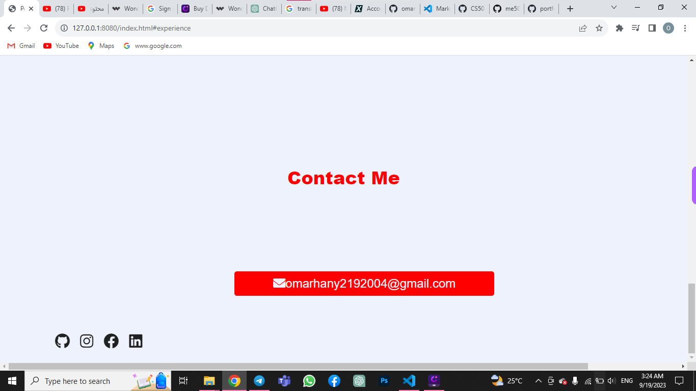

# Personal Portfolio - CS50 Final Project
#### Video Demo:https://youtu.be/AFzqBcH9Ajk
#### Description:


![Portfolio Screenshot]

This is my personal portfolio website, created as the final project for CS50. It serves as a showcase of my web development skills, providing an overview of my journey in the world of web development. This README.md file provides an overview of the project, its features, and instructions on how to set it up.

## Table of Contents

- [Project Overview](#project-overview)
- [Features](#features)
- [Technologies Used](#technologies-used)
- [Getting Started](#getting-started)
- [Usage](#usage)
- [Screenshots](#screenshots)
- [Contributing](#contributing)
- [License](#license)


## Project Overview

This personal portfolio is a representation of my growth and achievements as a web developer. It showcases my skills, projects, and experiences in the field. The project was built using HTML for structure and CSS for styling.

## Features

- **Homepage**: A welcoming landing page introducing visitors to the portfolio.
- **About Me**: A section providing insights into my background, interests, and experiences.
- **Projects Showcase**: Displays my best projects with descriptions and links to live demos or repositories.
- **Skills**: An overview of the technologies and tools I am proficient in.
- **Contact Information**: Allows visitors to get in touch with me.

## Technologies Used

- **HTML**: Used for structuring the web pages.
- **CSS**: Used for styling and layout.
- **JavaScript**: For adding interactivity and enhancing the user experience.

## Getting Started

1. Clone the repository to your local machine:

   ```bash
   git clone https://github.com/yourusername/your-portfolio.git

## Usage
Customize this portfolio with your own information, projects, and styling to make it your own. Feel free to modify the HTML and CSS files to reflect your unique personality and accomplishments.

## screenshots






## Contributing
I welcome contributions and suggestions. If you find a bug or have an enhancement in mind, please open an issue or submit a pull request.

## License
This project is licensed under the MIT License. See the LICENSE file for details.

Thank you for visiting my personal portfolio repository. I hope you enjoy exploring my work and learning more about my journey as a web developer. If you have any questions or feedback, feel free to reach out!